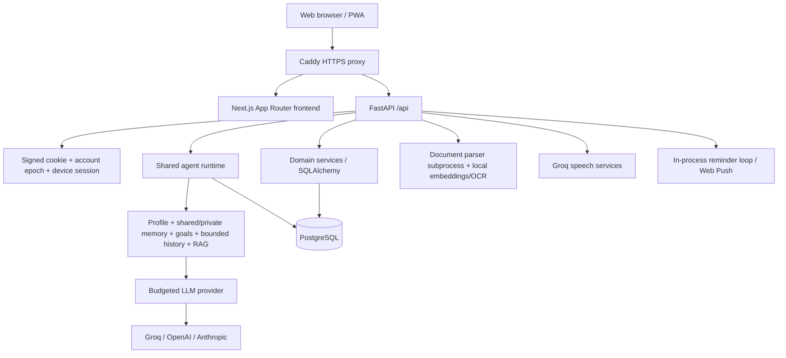

# FareeqAI technical audit — 3 October 2026

## Audit status and evidence

This is an evidence-backed review with outstanding verification, not production certification. Application code was not changed. The pre-existing frontend/package-lock.json modification was preserved. The repository inventory and central application, authentication, session, database, chat, agent context, provider, document, frontend API/stream/offline, and deployment flows were inspected. The local execution service stopped starting processes during the audit, preventing the remaining file-level review, synthetic reproductions, Python vulnerability scan, Git-history secret scan, and report verification. No real secret values were printed.

Evidence labels: **Executed** means a command ran and its result was observed; **Code** means implementation evidence, without a fresh end-to-end reproduction; **Gate** means evidence required before release remains missing. Earlier QA JSON and readiness documents are historical evidence only.

## 1. Executive summary

FareeqAI is a capable React/Next.js web application backed by a FastAPI modular monolith. Ten configured AI personas share a runtime, with account-scoped memory, conversations, goals, tracking, documents, and explicit multi-specialist consultation. PostgreSQL, Alembic, Caddy, container images, backup scripts, and monitoring support a single-host deployment. The fundamentals support a shared Web/iOS/Android backend without a microservice rewrite.

**Recommendation: withhold public production sign-off.** Complete dependency remediation and release verification, enforce limits before request parsing, address credential/session and shared-device privacy findings, and rehearse the exact release on PostgreSQL and HTTPS. A limited invite-only beta can follow these gates; there is insufficient evidence for unrestricted signup or multi-worker scaling.

Executed: backend pytest **541 passed, 4 skipped**; Ruff passed; frontend typecheck passed; ESLint **0 errors, 21 warnings**; installed Python dependency compatibility passed through uv; Markdown link policy checks passed. Two existing frontend hook-check scripts failed resolving the new i18n import. Production build did not complete: first Google Fonts network failure, then Turbopack worker port denial. Docker was unavailable. npm audit reported **12 findings: 1 critical, 9 high, 2 low**, including transitive/build dependencies; these are package findings, not twelve demonstrated remote exploits.

## 2. Architecture overview

Production Caddy routes /api/* directly to FastAPI and other traffic to Next.js. Local Next rewrites proxy /api to BACKEND_URL. Business and AI logic live in Python, not Next server actions. Settings load environment/.env; production validates authentication, HTTPS frontend, debug mode, and presence of a real provider/key.

Authentication: password or invitation key -> optional TOTP/recovery code -> persisted UserSession -> signed modeer_session cookie. Protected requests validate signature, expiry, user existence, epoch, device revocation, and suspension. The browser redirects on 401. Production cookies are Secure, HttpOnly, SameSite=Strict, path /api. There is no bearer/refresh-token API.

Chat: authenticate/charge request -> resolve owned conversation -> persist user message and plan actions -> gather scoped context -> reserve token budget -> stream provider text -> persist completion state -> send end event -> analyze memory and requested actions -> optional rolling summary. The composer is released before trailing memory work finishes. Retry reuses an unfinished user turn. Conversation locks are process-local.

Ask My Team is user-selected, sequential consultation of up to three specialists, followed by Leo synthesis. Specialists run without private notes or memory learning for this flow. It is not autonomous orchestration. Normal specialist chat is direct; Leo is not a universal router. No browsing, email sending, booking, trading, or executable model tools were found in the inspected runtime.

Key implementation: backend/app/main.py; api/deps.py; core/auth.py, sessions.py, usage.py; agents/runtime.py, context.py, team.py; api/routes/team.py; llm/provider.py; db/session.py, models.py; frontend/src/lib/api.ts and features/chat/useChatStream.ts; deploy/compose.yml and Caddyfile.

## 3. Repository structure

| Area | Responsibility / review status |
|---|---|
| frontend/src/app | App Router pages: login, signup, recovery, home, agents, chat, account, memory, goals, plans, week, team, money, CV, privacy. Page inventory complete; every UI branch was not individually exercised. |
| frontend/src/components | Chat workspace, account/security/preferences, memory/documents, tracking, templates, voice, comparison/reading tools. Critical API consumers inspected; full visual audit outstanding. |
| frontend/src/lib and features | API/data hooks, streaming, i18n, offline drafts/PWA, push, safe links/Markdown, import and formatting utilities. Central transport/privacy paths inspected. |
| backend/app/api/routes | Nineteen domain route modules, centrally registered under /api. Authentication and ownership traced across central routes; exhaustive route-specific review outstanding. |
| backend/app/agents | Registry/config/schema, ten prompt/eval packages, shared runtime/context, explicit handoffs and quality rubric. Runtime/context inspected; every prompt/eval not independently reviewed. |
| backend/app/{users,conversations,memory,goals,tracking,briefings} | SQLAlchemy domain behavior. Central persistence/isolation reviewed; complete extraction/tracking review outstanding. |
| backend/app/{documents,voice,push,cv} | RAG/local parsing, Groq speech, Web Push, CV exports. Main upload/ingest/push/speech/CV routes inspected. |
| backend/migrations | Twelve migration files, through 0012; migration integrity and PostgreSQL execution need a fresh release rehearsal. |
| backend/tests | Broad pytest suite; all discovered tests executed. |
| frontend/tools and deploy/tests | Scripted hook, browser, account, security, accessibility, container, PostgreSQL and operations rehearsals. Portable checks run; browser/container rehearsals outstanding. |
| deploy | Production Compose/Caddy, encrypted backups, restore checks, watchdog and scheduler wrapper. Linux paths inspected; production operation not verified. |
| docs | Architecture, status, privacy, operations, mobile roadmap and many dated quality/QA artifacts. Several current-code discrepancies found; earlier reports are not launch certification. |

## 4. What is already strong

- One server-side runtime and reusable domain services provide the right foundation for multiple clients.
- Owned-row queries and server-derived identity are used in the inspected conversation, memory, document, CV and template paths.
- Production refuses demo authentication/debug mode and a mock/missing provider key.
- Passwords use salted scrypt; invitation keys and recovery codes are hashed; session epochs and device revocation support logout and credential changes.
- Usage counters use atomic SQL admission and durable windows, not process-only counters. Provider token estimates are reserved before model calls.
- OpenAI-compatible replies have bounded wall/idle time, safe errors and persisted completed/truncated/interrupted/failed states.
- Context selection is bounded; RAG text is separated as untrusted data; Ask My Team suppresses private-note learning/forwarding.
- Document types are checked; filenames are display-only; DOCX bomb/entity checks and parser CPU/memory/time limits exist. Models/data are checksum-verified at build time.
- React renders model output as text; Markdown link schemes are restricted. The link checks passed.
- Production uses non-root application containers, private backend/database networks, TLS, nonce CSP, HSTS and hash-locked backend dependencies.
- Backup/restore and external watchdog scripts exist. Their presence is useful, but does not prove they are configured on the future host.

These are sound components; their individual passing tests do not establish complete production readiness.

## 5. Production blockers and release gates

Severity reflects release urgency; gates are distinguished from demonstrated vulnerabilities.

| ID | Severity / evidence | Location | Problem and impact | Recommended fix / release criterion | Production / mobile |
|---|---|---|---|---|---|
| B1 | P0 Gate; executed scan | frontend/package.json, package-lock.json, Dockerfile | Current Next 16.3.5 has a critical package advisory; other high/low dependency findings remain. Known next/og exploit conditions were not found. Fresh September advisories also need applicability review. | Upgrade to a verified supported patched release, remediate direct/transitive findings, document applicability, rerun scans/build/browser checks. Do not blindly apply audit's suggested framework downgrade. | Blocks public sign-off; web directly, shared release process for mobile. |
| B2 | P0 Code; abuse reproduction outstanding | deploy/Caddyfile; backend/app/api/routes/documents.py, voice.py | File limits are checked inside endpoint bodies, after framework multipart parsing; no global ingress body cap is configured. Oversized/multi-part or chunked bodies can consume temporary storage/resources before application rejection. | Enforce streaming request-size, part-count and timeout limits at ingress/ASGI before parsing; prove early rejection anonymously and with chunked requests. | Must fix before internet-facing launch; affects all uploads/clients. |
| B3 | P0 Gate | frontend/Dockerfile; deploy/compose.yml; migrations; deploy/tests | Exact production build, PostgreSQL migration and HTTPS/recovery rehearsal are not verified in this run. Docker unavailable and local build failed due environment restrictions. | Produce release images; migrate empty and upgraded PostgreSQL databases; exercise public HTTPS/auth/SSE; restore off-host backup; rehearse rollback; archive commit/digest evidence. | Blocks deployment approval; shared platform requirement. |

No remote code execution, cross-user transcript access, or authentication bypass was demonstrated in this run. Do not treat the dependency severity label as evidence of application exploitability.

## 6. High-priority issues

| ID | Severity / evidence | Location | Problem / why it matters | Recommended fix | Blocks production? / mobile impact |
|---|---|---|---|---|---|
| H1 | P1 Code | backend/app/main.py, _translated_validation_error; api/routes/auth.py request schemas | Serializes exc.errors(), including input. Invalid credential fields or model-level errors can echo submitted passwords/keys into responses and downstream diagnostics. | Return allow-listed loc/type/msg only; omit input/ctx, mark credential responses no-store; assert synthetic secrets never appear. | Resolve before public signup; all clients. |
| H2 | P1 Code; race reproduction outstanding | api/routes/auth.py login, _second_step, _lock_credentials | Login updates totp_last_step without the credential lock used by mutations; two sessions loading the same old state can accept the same code. | Atomic conditional step update or account lock+refresh, revalidate credentials/suspension before issuing session; concurrent PostgreSQL test. | Resolve before advertising replay-resistant 2FA; all clients. |
| H3 | P1 Code | auth.py recover vs login; api/deps.py | Recovery does not refuse suspended accounts and can reset password/issue a cookie reporting signed_in. Protected routes still refuse suspension, so this is inconsistent behavior, not demonstrated access bypass. | Apply suspension policy before spending code/changing credentials; regression test. | Before public recovery; all clients. |
| H4 | P1 Code | frontend/src/lib/offline.ts; lib/api.ts; features/chat/useChatStream.ts; AppShell.tsx | Draft keys omit account id. Explicit sign-out clears drafts; automatic 401/session expiry redirects do not. A new-account draft can be restored for the next user of that browser. | Namespace by authenticated account; clear state/drafts on every identity transition and 401; test expired-session account switching. | Resolve for shared-device privacy; mobile cache isolation too. |
| H5 | P1 Code | auth.py logout; frontend sign-out; push/service.py digest/send_due | Logout leaves Web Push subscriptions active. Detailed daily notifications may still reach a signed-out/shared browser. Details default true. | Bind pushes to devices; remove subscription on device logout/revocation; handle expiry/account changes; consider generic lock-screen text by default. | Resolve before enabling detailed reminders broadly; native devices too. |
| H6 | P1 Code | deploy/Caddyfile Permissions-Policy | microphone=() conflicts with microphone/voice functionality. | Allow microphone for self when enabled, otherwise disable the feature consistently; test actual HTTPS devices. | Blocks shipping enabled voice as functional; web voice first. |
| H7 | P1 Code | documents.py BackgroundTasks; documents/service.py ingest | Accepted upload bytes live only in process memory. Restart before ingestion leaves processing rows with no recoverable file/job. | Durable bounded job/input storage with TTL, or at minimum explicit interrupted recovery state and reupload; clean orphan jobs. | Before promising reliable uploads; mobile interruption particularly relevant. |
| H8 | P1 Code | agents/runtime.py release/end and _summarize_if_due; memory/service.py | Reply lock is released before memory/summary writes. Later turns can overlap stale extraction/summary state; same-key read-then-insert also risks conflicts across conversations. | Serialize/version derived writes; atomic upsert with manual-edit protection; prevent old analysis overriding newer state. | Harden before material concurrency; multiple devices increase exposure. |
| H9 | P1 Code | agents/runtime.py one_turn_at_a_time; conversations.py rewind/delete | Lock is process-local and mutation routes do not acquire it. Multi-workers can duplicate turns; edit/delete can race an active stream. | Persist turn id/claim and lifecycle; coordinate mutations; keep one worker until validated. | Multi-worker launch blocker; shared mobile conversations affected. |
| H10 | P1 Code | agents/context.py receipt; memory/service.py delete/update; users/service.py export | Full context receipts persist memory/profile text per answer. Removing a memory row does not erase historical receipts, prior chat or summaries. | Specify removal vs erasure; redact derived copies if promising erasure; retention policy and tests. | Before privacy promises/public launch; all clients. |
| H11 | P1 Code | db/session.py; async chat/team/document/push services | Synchronous SQLAlchemy work runs in async flows. Long transactions across awaits can hold pool connections; no explicit pool/statement/load limits. | Short transactions, bounded concurrency, measured event-loop/pool latency; thread offload or async DB where evidence warrants. | Capacity-dependent beta gate; platform scalability. |
| H12 | P1 Code | core/usage.py; auth.py throttles; push.py | Per-account quotas do not bound provider-wide spend/concurrency. Password throttling is email-based, allowing distributed guesses across addresses; keys/push test lack comparable attempt quotas. | Add global spend/concurrency/admission controls, IP+account login limits, bounded signup and push subscriptions/tests. | Before unrestricted signup; all clients. |
| H13 | P1 Code | llm/anthropic_provider.py vs openai_compat_provider.py | Anthropic lacks comparable finish-reason/error-event handling, timeout policy, usage true-up and provider-health accounting. An EOF after text can appear completed. | Bring advertised providers to one contract or support only the verified launch provider; mocked failure/length/usage tests. | Conditional blocker if Anthropic selected; all clients. |
| H14 | P1 Executed | frontend/tools/api-check.cjs, stream-check.cjs | Both existing hook checks fail with Cannot find module @/lib/i18n. They no longer verify current code. | Repair alias/i18n harness, expose checks in package scripts and run in CI. | Required test repair before release; future shared SDK affected. |

## 7. Security findings

Authentication and ownership foundations are solid in inspected flows. Production ignores X-User-Id identity selection. Cookie mutation checks compare Origin against FRONTEND_URL; this supports the same-origin web deployment, but comma-separated CORS origins are inconsistent with that single-origin equality. Native clients cannot safely be supported by merely weakening CSRF checks.

Prioritize H1/H2/H4/H5 and B2. Passwords use scrypt N=16384/r=8/p=1; review work-factor tuning against measured login capacity and a current password policy before public launch. TOTP seeds are deliberately stored plaintext in the database; envelope encryption with a separate key reduces database/backup disclosure risk. Access-key login uses high-entropy keys but still needs abuse/session-row growth limits.

No dangerous raw HTML rendering was found in the inspected Markdown renderer. Allowed external links can still be deceptive or hallucinated; XSS-safe links are not trustworthy recommendations. Push endpoint hosts are allow-listed and redirects are not explicitly enabled. Parser subprocesses limit crashes/resource abuse, but share application OS identity; this is not a full privilege/network sandbox.

Tracked-file listing showed only environment examples, not backend/.env or frontend/.env.local. Ignore and Docker-ignore rules exclude local secrets/databases. **This is not a completed secret scan**: local env values and all Git-history blobs were not scanned; no claim that secrets have never been committed is justified. Scan reachable history with a redacting tool and rotate any discovered credentials.

npm audit findings: Next critical; PostCSS and several glob/brace/Tailwind/ESLint dependency chains high; ESLint/plugin-kit low. Production image copies the entire build workspace, including dev dependencies, widening image footprint. Upgrade and slim the runtime image; distinguish build-time from reachable runtime vulnerabilities.

The next/og RCE advisory affects >=16.2.0,<16.3.6; no ImageResponse import was found. The September image-optimization SSRF advisory requires configured remotePatterns; the inspected config has none. These particular exploit conditions were not established. Other fresh advisories need release-specific review. Sources: https://github.com/vercel/next.js/security/advisories/GHSA-vcvr-r3jv-pc5j and https://github.com/vercel/next.js/security/advisories/GHSA-cjq9-62q9-8jv4 . Python vulnerability status remains unverified.

## 8. AI architecture findings

Leo/modeer: personal assistant, goals and team overview. Nova/study: learning. Tessa/travel: itinerary guidance. Nate/shopping: purchase guidance. Harvey/career: career/CV advice. Emma/finance: budgeting guidance. Maddie/fitness: exercise guidance. Alex/writing: composition. Clara/research: research guidance. Nora/email: drafts. These are configured personas, not independently deployed agents or external action tools.

Shared facts are account-scoped; private facts are account+agent-scoped. Goals/tracking and explicit handoffs add persistent context. Leo gets recent topic titles and requested notes, not all specialist transcripts. Team consultation suppresses private notes and learning; verify private-document filenames as well as passages in the remaining RAG review. Rule extraction exists; real-provider auto mode uses LLM analysis with a short timeout and conservative rule fallback. Manual memory edits protect user corrections. The complete model-output validator/extraction implementation still needs finishing review.

Context bounds and rolling summaries control prompt size, but services load full database history before trimming it. Prompt/token bounds do not bound SQL work. Receipts duplicate personal context into many messages, increasing retained sensitive text. Summary/analysis writes require versioning (H8). Deleted/corrected facts may remain in old chat/summary context; clarify and test intended behavior.

RAG passages ride in the user message, are labelled and explicitly untrusted. Pasted-text guards reduce instruction carryover. Prompts mitigate injection but do not provide a security boundary; authorization must remain server-enforced. The automatic analyzer can persist facts/goals/notes, so adversarial output and misleading pasted content need semantic-action tests. Finance/fitness/travel/shopping/research answers have no live browsing verification; generated sources, prices, schedules and advice must be treated accordingly.

Cost: ordinary reply = one chat call; qualifying learning adds one extraction call; long conversations periodically add a summary call. Ask My Team uses up to four reply calls, without duplicate specialist extraction. Voice has separate daily count quotas. Default account allowance is 60,000 tokens/day. Illustratively, 100 accounts fully consuming it means up to 6 million budgeted tokens/day; 1,000 means 60 million, before separate speech costs. This is a volume envelope, not a currency estimate. Reserve estimates include output/reasoning; true-up only refunds overestimates, so tokenizer/provider discrepancies require reconciliation. Add provider-wide budget, cost/latency by call kind, and constrained signup before scale.

## 9. Frontend findings

Next 16.3.5, React 19.0.0, TypeScript and Tailwind; App Router with predominantly client-side API integration. Lightweight useApi has loading/error/refetch and stale-response guards; useChatStream has cancellation, completion states and trailing memory updates. This is sufficient for a small app, but browser-specific transport and state should be separated for mobile reuse.

Typecheck passed; lint passed with 21 warnings, chiefly effect-driven state updates and internal window.location.assign navigation. Some hard navigation is useful for resetting account state; inspect intent rather than mechanically changing every instance. Two hook scripts are currently broken. Markdown safety checks passed.

PWA caches shell/static/artwork and avoids /api; browser drafts are stored locally. This supports offline shell/drafts, not offline conversation synchronization. Fix account scoping and 401 cleanup. Test old cached shell/new API compatibility and cached nonce CSP. NEXT_PUBLIC_API_URL points to same-origin /api; external URLs also require matching credentials and CSP connect-src changes, not merely CORS.

Build fetches five Google fonts. Self-host/pin assets for deterministic builds or explicitly validate build egress. Runtime/bundle size, real browser responsiveness, Safari behavior, screen-reader accessibility and contrast were not freshly measured. Historical axe/browser artifacts must be rerun on the release image, including Arabic RTL, keyboard dialogs, 390px layouts, voice and interrupted streams.

## 10. Backend findings

FastAPI routes delegate to domain services; Pydantic bounds many inputs; commit/rollback dependencies are present. Owned-row misses typically return 404. Chat validates conversation/session before sending HTTP 200, then uses SSE error events; retry conflict status inside the stream is an event field, not the actual HTTP response code. Document endpoints use 202 plus polling. Production disables the unused synchronous chat endpoint and interactive docs.

Primary reliability work: B2 and H7-H9/H11/H12. Implement request-id/turn-id idempotency for uncertain network outcomes, bounded in-flight work, database-coordinated turn lifecycle and mutation serialization. Do not add multiple Uvicorn workers before lock/scheduler behavior is safe. Keep provider HTTP clients reusable where measured useful; current clients are created per request. Team consultation is sequential and returned as one response, so worst-case latency is cumulative and a late synthesis failure can leave persisted specialist work without a complete client response.

Metrics are process-local. Access middleware timing stops at response creation, so SSE duration/failures cannot be inferred from HTTP 200/latency alone. Add turn completion and post-reply job metrics. Health/detail validates schema and sustained observed provider trouble, but no traffic means invalid credentials/model availability may go unnoticed until the first user call. Add a separate low-cost release/provider smoke test. Liveness returns a degraded JSON body rather than reliably using status codes for database failure; configure checks against readiness.

## 11. Database findings

SQLAlchemy models cover users, sessions, recovery, agents, conversations/messages, shared/private memories, goals, briefings, followups, plans/steps, checkins, documents/chunks, usage, Web Push/server keys, templates and CVs. Unique constraints protect emails, memory keys, usage buckets, push endpoints and daily digest claims; ownership/index patterns exist. ORM and PostgreSQL cascades support deletion; usage rows are explicitly deleted with an account.

The pool has pre_ping and hidden parameters; sizing/statement/lock timeouts are not explicit. Async code uses sync sessions. Conversation history/detail/list and export are unpaginated; search pulls account messages and filters in Python. Receipt JSON and embeddings add storage; load/performance should be measured on long-lived accounts. Index and constraint equivalence through all migrations was not fully reviewed/rerun; SQLite create_all tests do not prove PostgreSQL migration fidelity. SQLite foreign-key enforcement is not enabled in the inspected session module; ORM deletion behavior is tested but should not be confused with database-enforced referential integrity.

Count-then-create caps on documents/CVs/templates and read-then-insert memory/briefing paths can race. Use appropriate atomic admission/upsert/uniqueness. Repeated briefing refresh creates additional snapshots; select a bounded history policy. Export is memory-heavy and query-per-conversation, so large exports need bounded/streamed generation and explicit metadata coverage. Audit auth-throttle retention, push_sent growth, old receipt retention and backup erasure behavior. Fresh backup recovery and concurrent PostgreSQL tests remain release gates.

## 12. Testing findings

| Check | Observed result |
|---|---|
| backend .venv/bin/python -m pytest -q | 541 passed, 4 skipped in 12.57s; one Starlette TestClient deprecation warning |
| backend Ruff | Passed |
| Python installed dependency compatibility via uv pip check | Passed: 58 packages compatible |
| Frontend npm run typecheck | Passed |
| Frontend npm run lint | 0 errors; 21 warnings |
| frontend/tools/links-check.cjs | Passed: 8 allowed, 21 refused, renderer assertions |
| frontend/tools/api-check.cjs | Failed: unresolved @/lib/i18n |
| frontend/tools/stream-check.cjs | Failed: unresolved @/lib/i18n |
| npm run build | Failed Google Fonts fetch; network-enabled retry failed Turbopack worker port permission |
| npm audit | Completed; 12 package findings |
| Docker/container/PostgreSQL rehearsal | Not run: docker command unavailable |
| Python advisory scan; synthetic security probes | Not completed: execution service stopped starting processes |
| Git-history secret scan; fresh browser/accessibility/live-provider QA | Not completed |

Tests run primarily against isolated SQLite, mock LLM and keyword-only retrieval. Test inventory covers auth/accounts/2FA, memory/privacy/isolation, context, quotas, schema/release config, providers, interruption/retry, documents, tracking/push, data rights, observability, agents and quality runners. Four skips align with optional embedding/OCR availability; exact skip reason output was not collected. No verified coverage percentage was measured. A large number of passing tests does not establish live-model quality or true PostgreSQL concurrency.

Critical missing/fresh tests: concurrent TOTP consumption; credential response redaction; 401 account switching/drafts/push; upload/parser ingress abuse; crash during accepted ingestion; delete/rewind during stream; duplicate mobile submission; delayed memory writes after newer edits; multi-process turn claims; deletion/receipt/summary retention; large accounts/pool exhaustion; real-provider failure/usage parity; migration-upgrade/restore against release images.

Rerun the entire journey on HTTPS/PostgreSQL with a scripted failure-capable provider, then a bounded real-provider smoke test: signup/invite -> onboarding -> agent selection -> stream -> post-reply memory -> reload retrieval -> logout/login -> restored session, including second account denial.

## 13. Deployment findings

Production is single-host Docker Compose: PostgreSQL 16, Python backend, Node frontend, Caddy. Only 80/443 publish; volumes persist database and certificates. Images use pinned base digests and non-root app users; backend installs hashed runtime lock, models/OCR, then migrates before Uvicorn. Frontend installs with npm ci and copies the whole build workspace into runtime. No repository GitHub Actions workflow directory was found; other external CI is unknown.

Production ENVIRONMENT/DEBUG/AUTH_REQUIRED/DATABASE_URL/FRONTEND_URL are imposed by Compose; domain/database password and provider/auth/admin/feature settings come from private env. Keep signup disabled until controls are ready. Settings validate a non-mock provider but do not eagerly prove a supported provider/model; test actual launch configuration. Document the comma-separated CORS/Origin inconsistency and exact-name production environment semantics.

Deploy migrations as a controlled release step for future replicas; concurrent startup migrations are unsafe to assume. Compose has database health only and service dependencies do not constitute application readiness. Add backend/frontend health checks, log rotation and explicit resources; recognize a single host remains a failure domain. Bake/refer to release image tags/digests and retain rollback images. Database downgrades must be rehearsed, not automatic.

Linux backup requires key/off-host destination, encrypts, verifies copies and prunes; nightly wrapper restores from off-host. Restore check proves selected row counts, not full behavioral recovery. Distinct local paths do not prove separate failure domains. AES-CBC encryption lacks authenticated integrity; consider an authenticated archival format. Verify actual schedule, key recovery, storage mount, retention, alert delivery, RPO/RTO and restore application sessions/content. Off-host watchdog is necessary to detect a dead host. Public TLS/DNS and real-device SSE/voice are unverified here.

## 14. Mobile readiness

**Backend reuse: good. Mobile API readiness: incomplete.** Business logic and provider secrets already live server-side. Stable ids, sessions, ownership, conversation persistence, multipart uploads and SSE are useful foundations. No separate agent backend should be built for phones.

Before mobile development:

1. Preserve web HttpOnly-cookie/CSRF flow; add a deliberate native auth transport with short-lived access tokens, rotating hashed refresh tokens, replay detection, per-device revocation and secure credential storage. An Origin header is not native-client authentication. Apply the same account/epoch/suspension authorization to both transports.
2. Publish versioned /api/v1 contracts and typed DTOs/errors/SSE events. Production interactive docs can remain closed while CI emits a private OpenAPI artifact. Many dictionary responses need explicit schemas.
3. Create durable turn ids and client idempotency keys. Persist status/event sequence; reconnect by retrieving authoritative result or resuming events. Handle backgrounding/cancellation explicitly; POST SSE alone has no automatic replay.
4. Add cursor pagination, updated_since/sync cursors, conflict versions and deletion tombstones for conversations/messages/memory/plans. Poll/refetch-on-resume initially; WebSockets are optional until realtime need is measured.
5. Add APNs/FCM/Expo push device registry and logout/account-switch cleanup. Web Push VAPID is not the complete native push backend. Use generic payloads and authenticated retrieval for sensitive detail.
6. Design account-scoped offline cache, draft/outbox encryption/retention and idempotent retry. Current browser offline shell is not synchronized offline operation.
7. Define deep-link/universal-link/app-link ownership, stable resource routes and authenticated navigation.
8. Retain central file validation/RAG; adapt native pickers/photo processing/audio MIME and upload-progress cancellation. Make ingestion recovery durable before unreliable mobile networks increase reuploads.
9. Define compatibility/deprecation policy: store users update slowly. Test supported old app versions against each backend release.

## 15. Recommended mobile architecture

**Recommendation: React Native with Expo development builds, TypeScript, and native modules where needed.** This follows existing React/TypeScript skills and a server-side Python domain boundary. It is a recommendation based on code reuse; the team's actual native experience and product performance goals were not supplied.

| Option | Fit for FareeqAI | Tradeoff |
|---|---|---|
| React Native + Expo | Best default for chat, memory, plans, documents, voice and notifications; share contracts/translations/pure utilities | Native screen/layout/keyboard/permissions work remains; DOM components and Next routing are not directly reusable |
| React Native with manually managed native projects | Reasonable if platform modules/build control require it | More build and native-maintenance work; start with development builds unless a concrete constraint appears |
| Flutter | Viable with an experienced Dart team; same Python API | Less current client code/skill reuse; rewrite frontend utility/presentation layer |
| Swift + Kotlin | Best fit if deep OS-specific capabilities or measured performance justify two apps | Two client implementations, teams/release pipelines and duplicated presentation work |

Keep Next.js for web, add a separate mobile app, and extract transport-neutral contracts, i18n data, validation/format helpers and stream parsing into small shared packages. Keep identity checks, memory, agent orchestration, prompts, RAG, provider calls and quotas in FastAPI. Do not port Python agent logic into phones or expose provider keys.

Expo provides streaming fetch suitable for the current SSE approach (https://docs.expo.dev/versions/latest/sdk/expo/). SecureStore uses native protected storage for small credential values; it is not a whole transcript database (https://docs.expo.dev/versions/latest/sdk/securestore/). Remote push needs development builds (https://docs.expo.dev/push-notifications/what-you-need-to-know/). Validate release builds on physical iOS/Android devices, especially streaming after backgrounding, audio, Arabic RTL, keyboard scrolling and accessibility.

Set up independent iOS/Android signing, TestFlight/Play test tracks, native permissions, privacy disclosures, crash reporting and staged rollouts when mobile work begins. Backend compatibility should outlive a single app release. Native quality depends on implementation/testing, not solely framework choice.

## 16. Technical debt

| ID | Severity | Location / problem | Recommended work | Production / mobile |
|---|---|---|---|---|
| T1 | P2 | README and conftest comments describe deterministic memory/disabled team; current config uses real-provider LLM extraction and team enabled | One current architecture/config source; date/archive historical QA and superseded setup sections | Not inherently blocking; prevents wrong shared-platform assumptions |
| T2 | P2 | frontend package name crewai-frontend; legacy modeer identifiers; no CrewAI dependency | Clarify internal/domain naming and remove misleading branding incrementally | No; improves maintenance |
| T3 | P2 | frontend lint warnings; large ChatWorkspace; custom API hook | Address effect ownership/component boundaries based on behavior; retain meaningful account resets | No; eases transport reuse |
| T4 | P2 | Frontend runtime image contains source/build tooling/dev packages | Standalone/minimal runtime image, reproducibility and SBOM | No absent reachable vulnerability; shared supply chain |
| T5 | P2 | Duplicate account-resolution code in chat/team/deps, uneven response/error schemas | Shared auth adapter and typed response/event contracts | Web hardening; before mobile |
| T6 | P2 | In-memory metrics/background scheduler | Durable job/status metrics and coordinated scheduler as scale demands | Conditional on scale; native push reliability |
| T7 | P3 | No WebSockets/realtime sync transport | Add only if polling/resume does not meet measured UX needs | No; optional mobile enhancement |
| T8 | P3 | No microservice split | Keep modular monolith; extract only operationally independent workloads when justified | No; avoids duplicated platform logic |

The mock provider is a deliberate development/test implementation, rejected by production configuration. The non-stream chat route is deliberately production-disabled. Quality/eval tools and .partial artifacts are development evidence, not unused product features. Filenames alone do not prove dead code; a complete import/reference analysis remains outstanding. No broad refactor is justified by this audit.

## 17. Recommended roadmap

**Stage A — Critical fixes:** patch/triage dependencies; enforce pre-parser ingress limits; redact validation secrets; fix account-state/draft/push cleanup; atomic 2FA consumption; repair frontend hook tests; resolve microphone policy. Keep public signup off.

**Stage B — Production hardening:** durable upload recovery, bounded model/job concurrency and global spend, short transactions/pool configuration, safe memory/summary writes, coordinated stream/mutation lifecycle, deletion/retention semantics, provider contract parity, health/log/alert resource controls. Retain one backend worker until concurrency claims are validated.

**Stage C — Final testing:** release build and lock installs; Python/Node advisory and full-history redacting secret scans; PostgreSQL migrations/concurrency; HTTPS journey, cross-account tests, upload abuse/restarts, real provider smoke/quality, Safari/Android/iOS browser/RTL/accessibility, representative load, off-host restore and rollback. Close the remaining file-level extraction/tracking/migration/prompt review. Record commit, image digests, command outputs and explicit waivers.

**Stage D — Production deployment:** migrate tested schema, deploy immutable images, verify public DNS/TLS/readiness/login/SSE/persistence, configure off-host backup/watchdog/alerts, establish operator ownership and recovery objectives. Begin with a bounded invite list.

**Stage E — Post-launch monitoring:** track completion/truncation/error rates, first-token/end-to-end latency, memory failures, upload backlog, pool/disk pressure, per-call/provider spend, signup abuse and backup age. Expand audience only against observed capacity.

**Stage F — API/mobile preparation:** versioned typed API, native auth/refresh transport, turn idempotency/reconnect, pagination/sync/tombstones, device push lifecycle, compatibility and shared TypeScript packages. Keep Python business logic central.

**Stage G — iOS + Android development:** Expo/React Native development builds with native-quality chat/keyboard/voice/file flows; secure credentials and account-scoped cache; physical-device release tests; staged store deployment.

**Answers:** Before deployment, close Stage A/B release-relevant findings and produce Stage C evidence on the actual production stack. After stabilization, evolve the existing modular monolith into a versioned multi-client platform and build a separate Expo/React Native client sharing contracts and utilities. The environment interruption leaves this audit incomplete; remaining checks must be completed before calling it a full-repository production audit.
